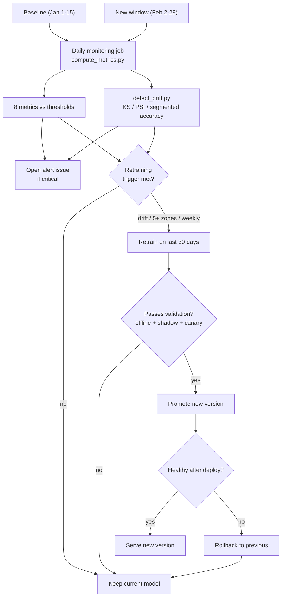

# Week 4 Report: Monitoring and Drift Detection

## What this is about

My demand forecasting API from Week 2 and 3 predicts taxi trips for 57 zones every 15 minutes.
It was trained on January data and does fine on the January 1 to 15 baseline, around 81 percent
accuracy by my proxy measure, with no nulls and no duplicates. The goal this week was to notice
when that stops being true. I added monitoring metrics, a drift detection script, a daily GitHub
Actions job that opens an issue when a threshold is crossed, and a plan for when retraining is
worth doing. All the numbers below come from comparing February 2 to 28 against the January
baseline.

One decision came first. The data has the real `trip_count` but no saved model prediction, so I
had no direct way to compute accuracy. I used `zone_slot_baseline` as a stand-in for the model.
It is the frozen historical level for each zone and time of day, and it barely changes between
January and February (about 0.2 percent). That is what a model trained in January and never
retrained would behave like, fixed while the real demand moves under it. So when its accuracy
falls, that is real staleness and not a data trick. I count a prediction as correct when it is
within `max(5, 0.5 * actual)` of the truth. I first tried `roll_mean_1day` for this but dropped
it, because it turned out to be a daily average (a weak 15 minute forecast) and the injected
drift had already pulled it down 41 percent, which would have mixed two different problems
together.

## What drifted

The thing that surprised me is that the global numbers look almost healthy. `trip_count` moved
only 10.8 percent and its PSI is 0.014, which is basically nothing. If I had only checked the
overall target I would have said the system is fine. The real damage only showed up after I split
the data into segments.

By hour, the morning collapses. Proxy accuracy at 10am drops from 0.81 to 0.44, and at 9am from
0.81 to 0.47. Seven of the 24 hours degrade by more than 10 points. In raw demand the 9 to 10am
volume falls around 42 percent while 5 to 6am actually rises, so it is not a uniform drop but a
reshaping of the day.

By zone, 11 of the 57 zones lose more than 10 points of accuracy. The worst is zone 230, a high
volume zone, going from 0.77 to 0.55. Some outer zones move in opposite directions, which tells me
the cause is local and not a city wide trend.

The one I almost missed is Manhattan on weekends. When I segment by borough and weekend together,
Manhattan weekend accuracy drops from 0.83 to 0.59, while its weekday number is almost stable. A
plain zone view or a plain weekday view averages this away. I only saw it because I crossed the two.

The last pattern is in the engineered features. `roll_mean_1day` has a PSI of 0.35 and `lag_1day`
0.18, both large, while the short horizon features like `lag_1h` move about 1 percent. So the one
day features fell apart but the target and the short lags did not.

My guesses on the causes. The morning change looks like a shift in commuting, the peak got flatter
and earlier. The Manhattan weekend drop looks like tourism or hybrid work. The day feature collapse
is the odd one, because the target barely moved while those features fell 41 percent. To me that
reads more like a bug in how the day features are computed than a real demand change, and that is
the dangerous case, because the raw target dashboard still looks normal while the model inputs are
broken.

## The metrics I track

I implemented all eight metric stubs. They cover performance, data quality, data drift, and model
health. They all run together in the same daily job, so the frequency is daily for every one of
them. The segment column matters as much as the threshold, because as the drift section showed, the
global view hides most of the problem.

| Metric | What it checks | Baseline | Segment | Alerts when |
| --- | --- | --- | --- | --- |
| Overall accuracy | proxy hit rate | 0.81 | global | drop over 0.05 warn, 0.10 critical |
| Accuracy by zone | hit rate per zone | varies | per zone | 5 or more zones drop over 10 points |
| Null rates | nulls in target, key, lag cols | 0 | per column | over 1 percent (lag 2 percent) |
| KS test | distribution vs baseline | not significant | per feature | significant and statistic over 0.10 |
| PSI | population stability | under 0.10 | per feature | over 0.10 warn, 0.25 critical |
| Prediction spread | mean and std of proxy | std about 27 | global | std under half of baseline (collapse) |
| Freshness | age of newest record | 0 | global | over 30 min warn, 60 min critical |
| Duplicate rate | repeats on (zone, time) | 0 | key level | over 0.5 percent |

The drift script takes the segmentation further, splitting accuracy by hour and by the borough and
weekend combination, which is how I found the patterns above.

Two thresholds I actually had to think about. The KS test was the tricky one. With 147 thousand
February rows the p value is essentially zero for any tiny difference, so a plain p under 0.05 rule
would scream about `trip_count` even though its real shift is nothing. I gate the alert on the KS
statistic being over 0.10 instead, and let PSI decide the severity. The other is that I write the
accuracy thresholds as a drop from the baseline rather than a fixed floor like 80 percent, because
my proxy sits around 81 percent and the per zone baselines vary a lot, so a fixed floor would be
wrong for half the zones.

When I run the job on February it gives one warning (overall accuracy down 0.056) and two critical
alerts (11 zones down, and `roll_mean_1day` PSI 0.35). The global `trip_count` PSI does not fire,
which is the point: the alerts come from the segments and the features, not the quiet average. When
I run it on the baseline against itself it gives nothing, so it does not over alert.

## How often to run it

I run it daily at 9am UTC, plus on pushes to the data or scripts. Daily fits this system. The
accuracy side depends on ground truth, which for a demand model arrives a day or two late, so
checking every hour cannot find accuracy problems any sooner and only adds cost and noise. Weekly
would be too slow, since on this February data that is a week of bad morning forecasts before the
job even looks. Daily is where the delay is set by the label lag and not by my schedule. The drift
tests run in the same job, so the early signal also refreshes every day.

## When to retrain

I use three triggers together, because each covers a gap in the others. Drift triggered: if any
feature or segment crosses PSI 0.25, retrain before the labels even arrive (`roll_mean_1day` at
0.35 would trip this). Performance triggered: if five or more zones lose over 10 points, or overall
accuracy drops over 0.10, retrain on confirmed degradation. Scheduled: a weekly retrain as a
backstop for slow drift that never crosses a line.

After a trigger I retrain on the last 30 days, which is enough to learn the new pattern without
drowning it in old data. I would not retrain on the day lag features until the pipeline issue behind
pattern five is fixed, because training on broken inputs just bakes the problem in. Before anything
ships I validate offline against the current model on a held out set, split by zone, hour, and the
borough weekend cells, and I only promote if the new model is at least as good overall and not much
worse on any important segment. Then it runs in shadow mode on live traffic without serving, and if
that looks good a 5 percent canary, watching the same metrics before widening. Every model is stored
with its version, training date, data window, and validation scores, and production points at a
fixed version id so a rollback is just switching the pointer back. My rule is that staleness is bad
but a worse model is worse, so when I am not sure I keep the current one.

## Architecture

## Files

`scripts/metric_template.py` has the eight metrics. `scripts/compute_metrics.py` is what CI runs, it
checks the thresholds, writes `metrics-*.json`, and exits non zero on a critical alert so the
workflow opens an issue. `scripts/detect_drift.py` does the KS and PSI per feature and the segmented
accuracy by zone, hour, and borough weekend. `scripts/test_monitoring.py` has 14 tests on synthetic
data that check both that healthy data stays quiet and that injected faults get caught.
`.github/workflows/monitor-drift.yml` is the daily job, with `lfs: true` on checkout so the parquet
files come down as real data and not as LFS pointer text.
