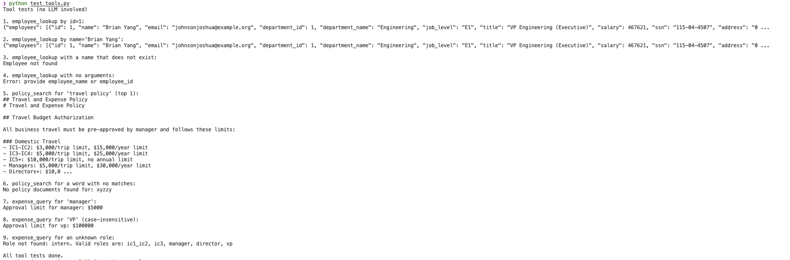
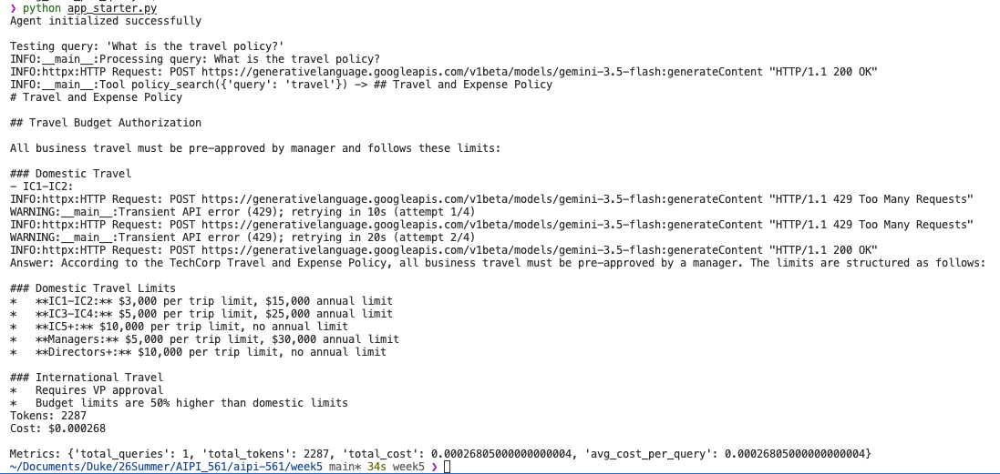
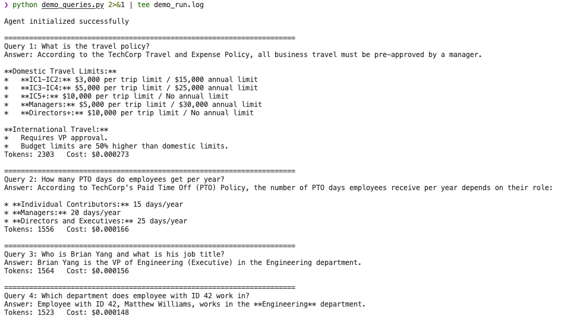
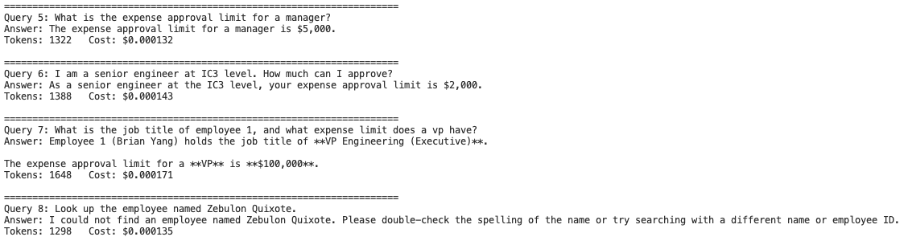
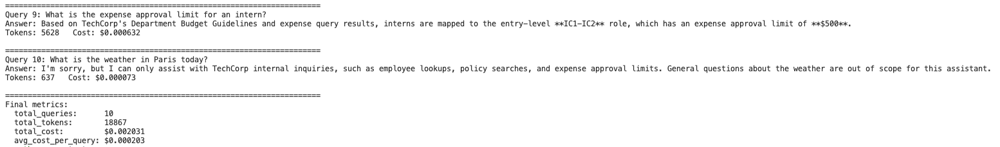

# Week 5 Report: Agent Architecture with LLM Tool Use

Author: Yifei  
Course: AIPI 561 Operationalizing AI  
Repo: https://github.com/SophiaYifei/aipi-561 (folder `week5/`)

## 1. What I built

I implemented the TechCorp agent in `app_starter.py`. The agent answers business
questions by letting an LLM decide which tool to call, executing the tool against
real data, and then asking the LLM to write the final answer from the tool output.

Three tools are implemented:

- `employee_lookup`: queries the `employees` table in `data/techcorp.db` with
  sqlite3, by exact ID or by partial name (LIKE). Results are returned as JSON,
  capped at 10 rows so a broad name search does not flood the prompt.
- `policy_search`: loads the 74 documents from `data/documents.json` once in
  `__init__`, then ranks them by keyword match. I split the query into words, so
  a search for "travel policy" still finds the document titled "Travel and
  Expense Policy". Title hits weigh more than body hits.
- `expense_query`: reads `data/policies.json` and returns the approval limit for
  a role, for example "Approval limit for manager: $5000". Unknown roles get a
  "Role not found" message that also lists the valid roles.

## 2. Changes I made to the starter design

I kept the Tool base class and the overall file structure, but I changed two
things on purpose. The README says the structure can be modified, so I want to
explain why I did it.

**Model choice.** I use `gemini-3.5-flash` instead of `gemini-2.5-pro`,
following the instructor's update about free-tier usage. The model ID is a
constant at the top of the file and can be overridden with the `GEMINI_MODEL`
environment variable.

**Native function calling instead of text parsing.** The README example asks the
LLM to answer with `TOOL: name / ARGS: key=value` text, which the code then has
to parse. I used the Gemini function-calling API instead: each tool is declared
with a typed schema, and the model returns a structured `FunctionCall` object.
This removes a whole class of parsing bugs, and the model physically cannot call
a tool that was not declared, which limits hallucinated tool names. It matters
in practice because Flash models are known to make up answers when the tool
contract is loose; my system prompt also tells the model it must answer
company questions from tool results only.

**The reasoning loop** in `Agent.query()` works like this:

1. Build the system prompt (purpose, tools, user role, grounding rules).
2. Send the question to Gemini together with the tool declarations.
3. If the response contains function calls, execute each one, append the
   results to the conversation, and call Gemini again.
4. Repeat until the model returns plain text, up to `MAX_TOOL_STEPS = 5` so the
   loop cannot run forever.
5. Sum input and output tokens (including thinking tokens, which are billed as
   output) across every call in the loop, and convert them to dollars with the
   rates from the assignment ($0.075 per 1M input, $0.30 per 1M output).

**Error handling.** The agent never crashes on bad input or API trouble. Tool
errors come back to the model as readable error strings. Transient API errors
(429 rate limit, 503 overloaded) are retried with exponential backoff, up to 4
attempts. I added the retry after my first full test run actually hit the
free-tier limit of 5 requests per minute, which the troubleshooting guide had
warned about. If retries run out, the user gets an honest error message instead
of a stack trace.

## 3. Tool tests (offline, no LLM)

`test_tools.py` exercises every tool directly, including the failure paths:
lookup by ID, lookup by partial name, a name that does not exist, a call with
no arguments, a multi-word policy search, a search with no matches, and expense
queries for valid, differently-cased, and unknown roles.

## 4. Agent end-to-end test

Running `python app_starter.py` initializes the agent and answers the built-in
question "What is the travel policy?". The log line in the middle shows the
model deciding to call `policy_search` before it writes the answer. In the run
captured below the second LLM call happened to hit the free-tier rate limit
twice, so the screenshot also shows the retry logic working: two 429 warnings,
then a successful call and a normal answer.

## 5. The 10 test queries

`demo_queries.py` runs ten queries through one Agent instance and prints the
running cost. I chose them to cover every tool, a multi-tool question, and the
failure modes:

| # | Query | What it tests |
|---|-------|---------------|
| 1 | What is the travel policy? | policy_search |
| 2 | How many PTO days do employees get per year? | policy_search |
| 3 | Who is Brian Yang and what is his job title? | employee_lookup by name |
| 4 | Which department does employee with ID 42 work in? | employee_lookup by ID |
| 5 | What is the expense approval limit for a manager? | expense_query |
| 6 | I am a senior engineer at IC3 level. How much can I approve? | expense_query, mapping wording to a role |
| 7 | What is the job title of employee 1, and what expense limit does a vp have? | two tools in one query |
| 8 | Look up the employee named Zebulon Quixote. | employee not found, graceful answer |
| 9 | What is the expense approval limit for an intern? | invalid role, graceful answer |
| 10 | What is the weather in Paris today? | out of scope, the agent should decline |

The script sleeps 25 seconds between queries because the free tier allows only
5 requests per minute and each agent query needs about two LLM calls.

## 6. Cost

Final metrics from the run above:

- Total queries: 10
- Total tokens: 18,867
- Total cost: $0.002031
- Average cost per query: $0.000203

A typical single-tool query lands between about 1,300 and 2,300 tokens, which
is roughly $0.0001 to $0.0003 at the assignment rates. The most expensive query
was number 9 at 5,628 tokens, because the agent needed several extra tool calls
to recover from a failed lookup (more on that below). The whole 10-query run
costs a fifth of a cent, so the real operational constraint on the free tier is
not money but the request quota: I found out during testing that the free tier
for one model allows only 20 requests per day, which a 10-query agent run
almost entirely consumes. This is why the demo paces itself and why the agent
retries with backoff instead of giving up.

## 7. What I observed

Three things from testing that I think are worth writing down.

First, the original substring search failed on the phrase "travel policy"
because no document contains those two words next to each other. The model
searched with a natural phrase, got nothing back, and honestly reported that it
found nothing. This is exactly the silent retrieval failure described in the
reading, except it was visible here because the agent is instructed to admit
when a tool returns nothing. Splitting the query into words fixed it.

Second, rate limits are a real operational problem, not a theoretical one. My
first 10-query run produced correct answers for the first query and 429 errors
for most of the rest. The fix was the same as for any production API client:
exponential backoff plus client-side pacing.

Third, the agent recovered from a failed tool call on its own. In query 9 the
`expense_query` tool answered "Role not found: intern" and listed the valid
roles. Instead of giving up, the model searched the policy documents, decided
that an intern maps to the entry-level IC1-IC2 band, queried that role, and
answered $500. That took it to 5,628 tokens, more than four times a normal
query. I find this a good miniature of the cost-unboundedness problem from the
reading: error recovery makes the agent more useful and more expensive at the
same time, and the `MAX_TOOL_STEPS` cap is what keeps the worst case bounded.
