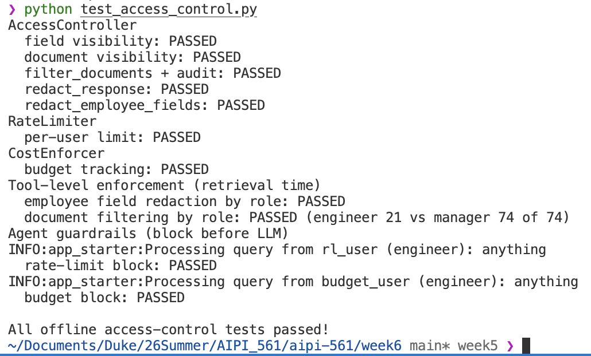
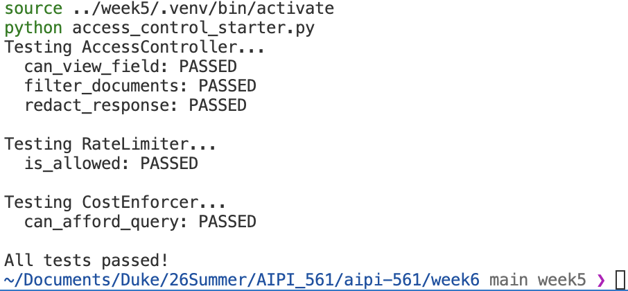
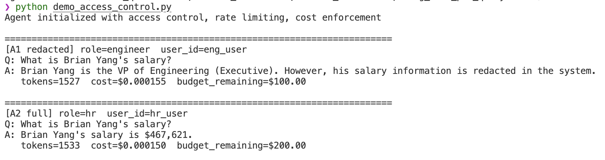
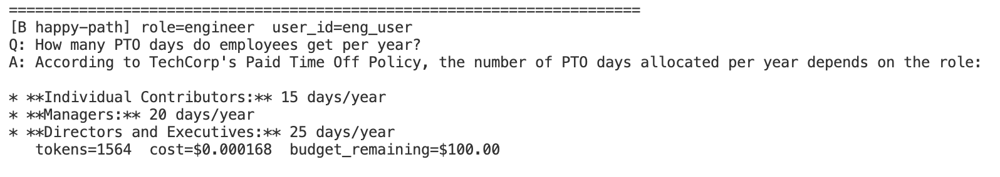
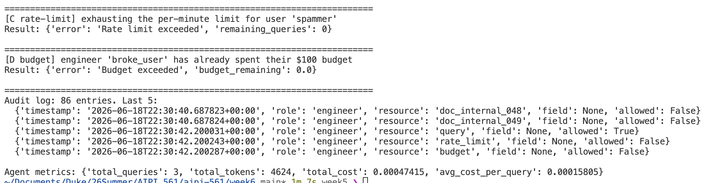

# Week 6 Report: Access Control and Monitoring

## 1. What I built

This week I added four guardrails around the Week 5 TechCorp agent: role-based
access control, rate limiting, cost enforcement, and an audit log. The three
guardrail classes live in `access_control_starter.py`, and I integrated them
into a copy of my Week 5 `app_starter.py`. The whole of `week6/` is
self-contained: it starts from my Week 5 code and I only edited the copies
inside this folder.

The design principle I followed is the one the README and reading both stress:
a guardrail should block a request *before* it reaches the LLM, not clean up
afterwards. Rate limiting and budget checks therefore run at the very start of
`query()`, before any token is spent, and access control is enforced at
retrieval time inside the tools, so the model never reads data the user is not
allowed to see.

## 2. The three guardrail classes

**AccessController** loads `data/access_control.json` and enforces it at three
levels:

- `can_view_field(role, field)` checks the `sensitive_fields` table. For
  example `salary` is visible to manager, hr, finance, and executive, but not
  to engineer. A field that is not listed is not sensitive and is visible to
  everyone.
- `can_view_document(role, doc)` checks the document's sensitivity
  (Public / Internal / Confidential / Restricted) against the `document_access`
  table. An unknown or missing sensitivity is denied, following the fail-safe
  default from the reading.
- `redact_response(role, text)` scrubs the values of fields the role cannot see
  out of a free-text answer, keeping the field name so the reader can tell that
  something was withheld. `filter_documents` and `redact_employee_fields` apply
  the same rules to structured data, and every decision is written to the audit
  log with a UTC timestamp.

**RateLimiter** tracks each user's query timestamps in a sliding 60-second
window. `is_allowed` allows and records a query if the user is under the limit
and denies otherwise; different users have independent budgets. I set the agent
limit to 30 queries per minute.

**CostEnforcer** holds a monthly budget per role (engineer \$100, manager
\$500, hr \$200, finance \$500, executive \$1000) and a running total per user.
I added a `role` parameter to `can_afford_query`, because a brand-new user has
no spending record yet and so no role to look their budget up from. This is the
approach the starter's own TODO suggests, and it is what the agent uses when it
passes `user_role` on the first query.

## 3. How I integrated it with the Week 5 agent

I made the design choices the instructor asked us to make rather than relying on
the starter snippet alone.

**`query()` now takes `user_id` and `user_role`.** `user_id` is what the rate
limiter and cost enforcer track; `user_role` is what access control uses. At the
top of `query()`, before building the prompt, I check the rate limit and the
budget and return a structured error if either fails. No LLM call happens on a
blocked request.

**Access control is enforced at retrieval time, not only on the final answer.**
This is the more robust option the instructor mentioned. Before the reasoning
loop runs, the agent tells each data tool which role is asking:

- `EmployeeLookupTool` redacts sensitive columns (salary, ssn, address, and the
  compensation fields stock_options and bonus_eligible) *before* returning rows
  to the model, using `redact_employee_fields`. So when an engineer asks for a
  salary, the model literally receives `[REDACTED]` and cannot leak the number.
- `PolicySearchTool` calls `filter_documents` first, so it only ever ranks and
  returns documents the role is allowed to read. This is the direct fix for the
  "oversharing" case study in the reading, where an agent answered from
  documents the user should never have been able to retrieve.

This is also what makes the audit log meaningful: `can_view_document` and
`can_view_field` are called on real lookups, and each call logs an entry, so the
log records who tried to read what and whether it was allowed.

**Redaction on the final answer is kept as a second layer.** After the model
produces its answer I still run `redact_response`, so any sensitive value that
slipped through is scrubbed. The same query also records its real cost against
the user (the actual token cost from the Week 5 cost tracking, not a hard-coded
estimate) and writes an audit entry.

## 4. Offline tests

`test_access_control.py` exercises every guardrail without calling the LLM, so
it runs freely without touching the free-tier daily quota. It covers field and
document visibility for several roles, `filter_documents` plus its audit
entries, response redaction (value removed, field name kept, and the allowed
role left untouched), structured employee redaction, the per-user rate limit,
budget tracking, the tools enforcing access at retrieval time, and the agent
returning rate-limit and budget errors before any LLM call.

A useful concrete result: an engineer can retrieve 21 of the 74 policy
documents (the Public and Internal ones), while a manager can retrieve all 74,
because 53 of the documents are Confidential.

The original starter self-test still passes too, so the basic grading checks
hold:

## 5. End-to-end demo with the live agent

`demo_access_control.py` is the only script that calls Gemini. It is small on
purpose: the free tier allows about 20 requests per model per day and each agent
query makes roughly two LLM calls, so the live part is three queries and the
rate-limit and budget demos at the end use no LLM.

**A. Same question, two roles.** I ask "What is Brian Yang's salary?" as an
engineer and then as HR. The engineer gets a redacted answer because the tool
returned `[REDACTED]` for the salary column; HR gets the real figure.

**B. Happy path.** A normal policy question ("How many PTO days do employees get
per year?") still works for an engineer, to show the guardrails do not break
ordinary use.

**C and D. Blocked requests.** I exhaust the per-minute limit for one user and
the monthly budget for another, then show each query returning a structured
error (`Rate limit exceeded`, `Budget exceeded`) with no LLM call. The run ends
by printing the tail of the audit log and the agent metrics.

## 6. What I observed

The most useful thing I saw is that enforcing access at retrieval time and on
the final answer are not redundant. Retrieval-time redaction is what actually
protects the data, because the model never sees it. Final-answer redaction is a
cheap safety net for the case where some sensitive value reaches the answer by
another path. Doing only the second one, as the minimal starter does, would
still send the real salary to the model, which is exactly the leak the reading
warns about.

The second thing is that the cheap guardrails are the most important
operationally. Rate limiting and budget checks cost nothing because they run
before the LLM, and on the free tier, where the real constraint is the 20
requests per day rather than dollars, blocking a bad request before it spends a
call is the difference between a working demo and an exhausted quota.
